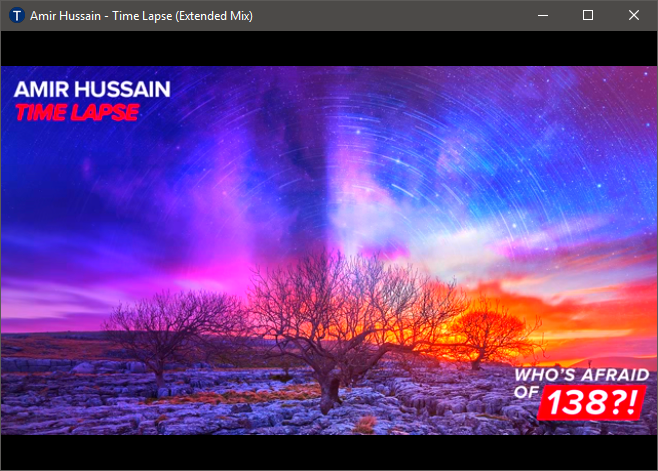
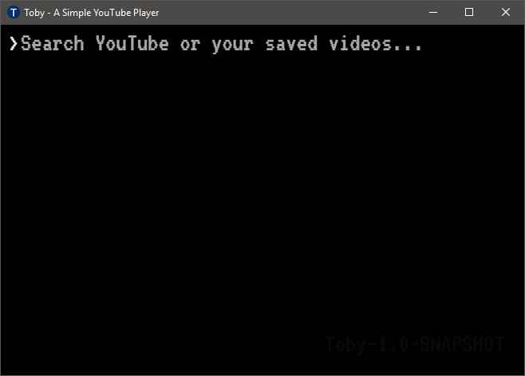
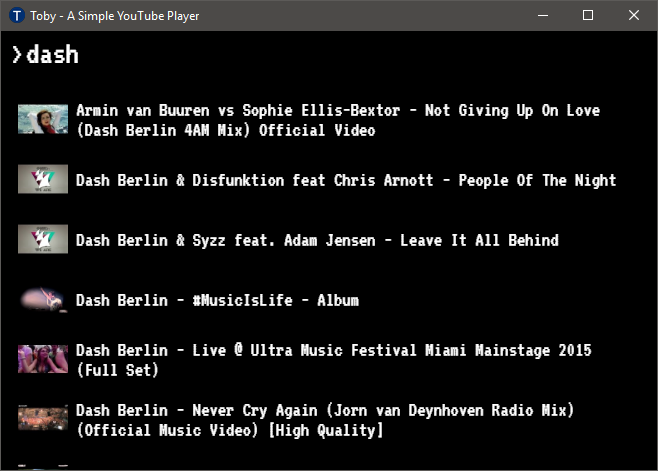
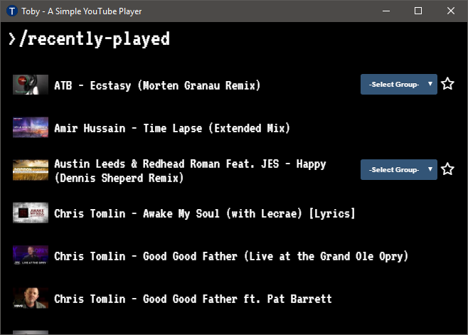
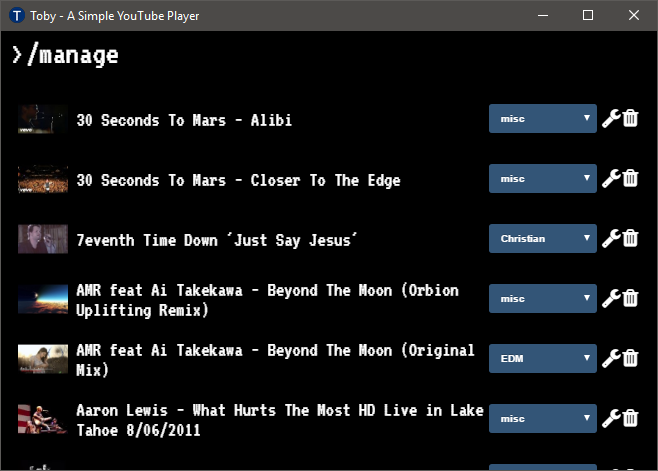
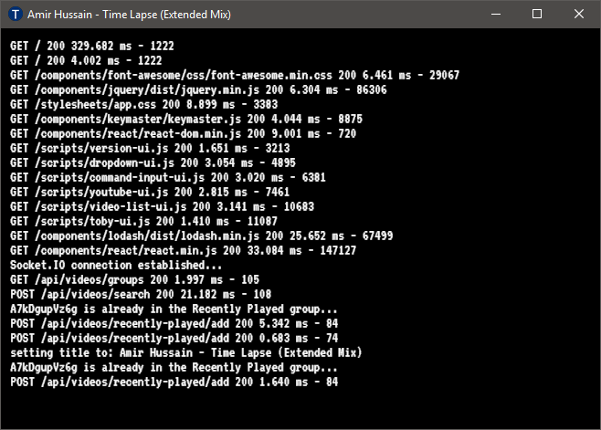

# Toby

[](https://gitter.im/frankhale/toby?utm_source=badge&utm_medium=badge&utm_campaign=pr-badge&utm_content=badge)

Toby is a simple YouTube player for the desktop.

### Screenshots

Toby In Action:



Toby Main UI:



Toby Video List:



Toby Recently Played:



Toby Manage Videos:



Toby Server Log:



### Architecture

The old Toby architecture was geared towards an Electron deployment and I loaded
all the code from the file system. The new architecture puts Toby behind an
Express web application that is spawned from a regular Node process so that more
deployment scenarios.

A Toby deployment would ship the regular Node.exe and Node.dll files along side
the source code. We know NW.js and Electron ship with Node embedded but shipping
Node as an external resource allows us to run Toby in a regular Node process and
unencumbered by NW.js / Electron specific compiling requirements for any
potential native Node modules we may want to use in the future. The only native
Node module being used to my knowledge is SQLite3.

Having Toby behind an Express app makes it fairly trivial to deploy to NW.js,
Electron and support a regular web browser. You need a fairly minimal set of
supporting files to bootstrap the app in those environments.

Toby is meant as a personal application running on a personal computer and it's
web API is not password protected in any way and there has been no attempt to
protect the data Toby collects. Toby only cares about a few things, namely
YouTube video titles, ids and the groups you decide to store your favorite
videos in.

## Status

NW.js and Electron should be working (I need to provide some info here on ways
to run the code from a development perspective, TODO!)

### How can I run this code?

Toby is becoming more generic and not just for Electron. In a perfect world Toby
will run in Electron, NW.js and in a web browser. That said, it takes time to
make sure all environments keep up. At the moment I am concentrating on
delivering NW.js support. When I get finished with NW.js I will work on
Electron. Likewise for web but I've already done a bunch of work to make sure it
works on web so that should still be working. Please note that it's highly
likely that this 'rewrite' branch is broken at any given time but I will do my
best to make sure it's not.

All that said, I use Toby all the time so if things are broken they probably
won't stay broken for long.

It should be noted that these instructions are for the impatient and that a
proper distribution will be created and released that is easy to get up and
running and requires none of the instructions that are or will be listed below.

#### Dependencies

- Node : http://nodejs.org
- Grunt : http://gruntjs.com
- Bower : http://bower.io/

In addition to installing Node on your machine so you can download the
dependencies and build the code you'll also need a copy of the Node binaries to
place at the root of the source code folder. This is because when NW.js and
eventually the Electron build are executed they will spawn a Node process and
start the Toby server. The requirement to ship the two Node binaries is so that
we can support machines that don't have Node installed (this is for the time
when a proper distribution will be available).

The required Node binaries are located here (for example):

https://nodejs.org/dist/v6.0.0/win-x64/

Here is what the directories look like:

NW.js root dir:


package.nw dir:


Install dependencies  

```
npm install   
bower install
```

The code needs to be built using Grunt  

```
grunt
```

Running in NW.js

- Download a copy of NW.js from : nwjs.io
- Unzip NW.js
- Create package.nw directory inside the unzipped NW.js folder
- Copy the Toby distribution files to the package.nw
- Install all Toby dependencies using npm and bower (see above)
- Build Toby using grunt (see above)
- Double click the nw.exe in the NW.js unzipped folder

Running in Electron

TODO

Running in a web browser

TODO

### Usage

**Important Key Combos:**

<kbd>F1</kbd> - Toggles server log  
<kbd>F5</kbd> - Usage Info (NOT IMPLEMENTED YET)  
<kbd>F11</kbd> - Toggle Fullscreen

In addition to keyboard shortcuts there are commands that can be typed into the
search box that will perform various things.

Here is a list (there will be additional ones added soon):

- `[name hint]` : Lists locally saved videos based on the [name hint]
- `/yt [search term]` : Searches YouTube for the [search term]
- `/g [group name]` : Lists the videos for the [group name]
- `/list` : List all videos contained in the database
- `/history` : Lists the recently played videos
- `/rp` or `/recently-played` : List last 30 recently played videos
- `/manage` : Manage what groups videos are in and also provide ability to delete videos
- `/archive` : Export the contents of the database to the data.txt file
- `/clear` : Clears search results
- `/monochrome` : (NW.js/Electron only) Short cut to set the monochrome video filter and
thumbnails in search results
- `/saturate` : (NW.js/Electron only) Short cut to set the saturated video filter and
thumbnails in search results
- `/sepia` : (NW.js/Electron only) Short cut to set the sepia video filter and
thumbnails in search results
- `/normal` : (NW.js/Electron only) Short cut to set the normal video filter and
thumbnails in search results
- `/filter monochrome` : (NW.js/Electron only) Short cut to set the monochrome video filter and
thumbnails in search results
- `/filter saturate` : (NW.js/Electron only) Short cut to set the saturated video filter and
thumbnails in search results
- `/filter sepia` : (NW.js/Electron only) Short cut to set the sepia video filter and
thumbnails in search results

### Features TODO

- Caching YouTube search results for a bit to avoid querying YouTube over and
  over for the same thing
- Usage info from within the app
- Add `/import` to import new videos in the data.txt file
- Add better support for larger data sets. Currently if there are a large number
of search results (excluding YouTube searches which default to 25 results) all
the results will be listed.

### Updating the data file

Unlike previous versions of Toby the data.txt file located in the data folder is
now only used initially to create the database which stores your favorite
videos. Videos stored in the database can be exported by entering the `/archive`
command in the search box. A corresponding `/import` command has not been
implemented yet.

The data format for your favorite videos is very simple. It can contain one or
more groups. The 'Recently Played' group is special and will be added if it's
not present hold the last 30 videos you've recently played.

Data Format:

```
Group Name {
  Video Title : Video Id
}
```

See real example below:

```
Recently Played {
  Sunlight Project feat Danny Claire - Stay (tranzLift Remix) Promo : yWQvWTM7Hqg
  Dash Berlin - Underneath The Sky (Sunsound Chillout Remix) : UEqMD-5urik
  Chris Tomlin - Awake My Soul (with Lecrae) [Lyrics] : fWpvknKuYrg
  Chris Tomlin - Good Good Father (Live at the Grand Ole Opry) : eaqaER7dasY
}
```

## Author(s)

Frank Hale &lt;frankhale@gmail.com&gt;  
25 May 2016

## License

GNU GPL v3 - see [LICENSE](LICENSE)
